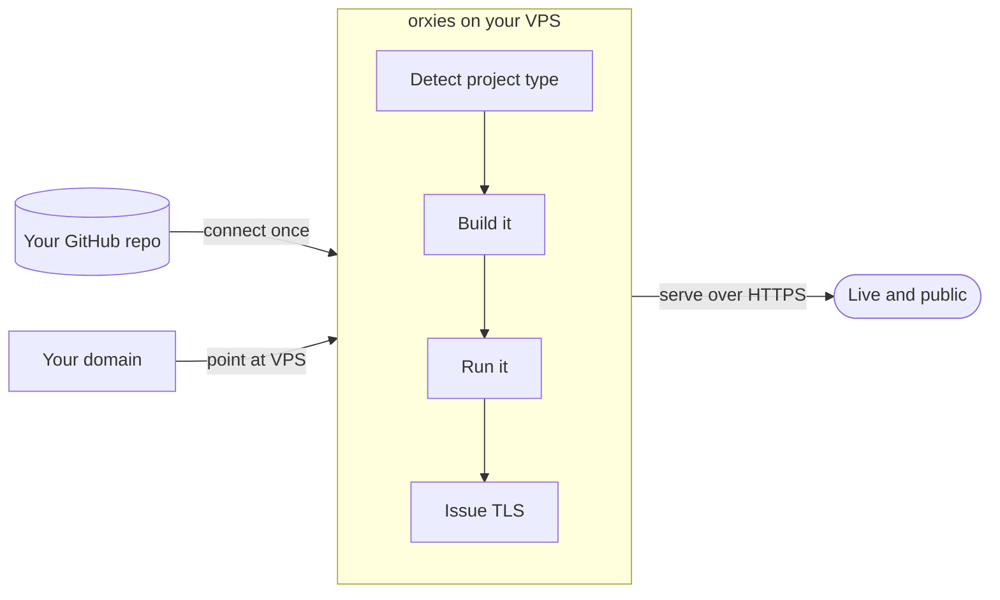
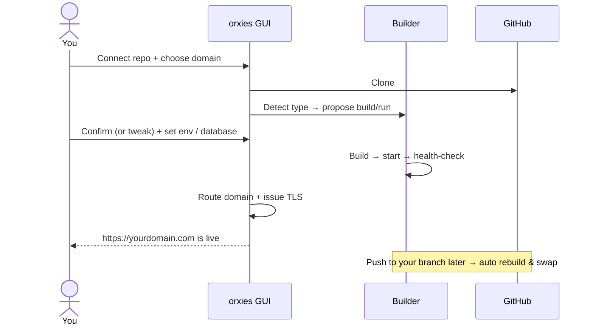

# orxies

**A self-hosted deployment platform for your own VPS.** Point a domain, connect a Git repo, and orxies figures out how to build it, run it, and put it live over HTTPS — for static sites, React/Vue/Next, WordPress, PHP, Python, Go, or anything with a Dockerfile. No SSH, no manual `git clone`, no per-project nginx/certbot wrangling.

Think of it as the security-first, single-binary, open-source lane next to Vercel/Railway — but running entirely on **your** server, with **your** data.

> **Status — read this first.** orxies today is a hardened **reverse proxy + static host + automatic TLS + admin GUI**, and a working **deploy engine**: **connect a Git repo** (or point at a folder), and the Projects section clones it, auto-detects the type, builds it (any `Dockerfile`), runs it in a container, health-checks it, and routes your domain — with **zero-config Nixpacks builds** (Node/Next/Python/Go/PHP, no Dockerfile needed), **zero-downtime redeploys**, **deploy-on-push webhooks**, encrypted tokens for private repos, live logs, and stop/remove — plus **managed databases** (Postgres/MySQL/Redis) with credentials auto-injected into your app (Phases 3–5 ✅). Still on the roadmap: per-framework recipes (WordPress, static-export), rollback history, and service backups. Throughout these docs, **✅ = works today**, **🚧 = planned**. Full plan + diagrams: **[docs/ARCHITECTURE.md](docs/ARCHITECTURE.md)**.

## The idea



You bring a repo and a domain. orxies recognises what the project is (a Vite SPA needs `npm run build` and its `dist/` served; a Next.js app needs a running node server; WordPress needs PHP + a database; a folder of HTML just needs serving), does the right thing, and keeps it online.

## What you can deploy

| Project type | orxies's job | Today |
|---|---|---|
| **Static / raw HTML** | Serve the folder directly over TLS | ✅ |
| **Reverse-proxy any running app** (Docker or a bare `host:port`) | Route a domain to it, terminate TLS | ✅ |
| **React / Vue / Vite (SPA)** | Detect → `npm run build` → serve `dist/` with SPA fallback | 🚧 |
| **Next.js / Nuxt (SSR)** | Detect → build → run the node server → route domain | 🚧 |
| **WordPress** | Run WordPress + a managed or external database, persistent uploads | 🚧 |
| **Raw PHP** | Run PHP-FPM + a web server, optional database | 🚧 |
| **Anything with a Dockerfile** | Build the image, run it, route the domain (via Projects) | ✅ |
| **Node / Next / Python / Go / PHP (no Dockerfile)** | Nixpacks zero-config auto-build → run → route | ✅ |
| **docker-compose** | Bring up the stack, route the web service | 🚧 |

Anything that needs a database gets a choice: **use an orxies-managed one** (Postgres/MySQL/Redis in a container on a shared network, credentials generated + injected as `DATABASE_URL` for you) or **bring your own** connection string. ✅

## The deploy flow (target)



## Why it exists

Hosting several projects on one VPS usually means juggling nginx + certbot per project, or touching every project's compose for Traefik labels, or running a dated Nginx Proxy Manager. And *deploying* those projects is a separate manual chore of `git clone`, build, systemd/pm2, and repeat.

orxies collapses all of that into one hardened GUI: **domains** (add, point, TLS), **projects** (connect a repo, auto-build, deploy, roll back), and **services** (managed databases) — on a single ~12 MB Go core that idles around 30 MB of RAM. Every mutation is CSRF-protected, 2FA-guarded, rate-limited, and audit-logged (see [Security](#security-notes)).

## Features

- **Reverse proxy** with round-robin load balancing across multiple upstreams per site — any `host:port` that speaks HTTP (Docker or not).
- **Static hosting built in** — serve raw HTML, a portfolio, or a Next.js/Vite static export straight from a folder, with optional SPA fallback. No sidecar server.
- **Auto Let's Encrypt** via [`certmagic`](https://github.com/caddyserver/certmagic) — same library Caddy uses in production. Auto-renewal, OCSP stapling, ACME http-01.
- **Live traffic dashboard** — per-site requests/min, bytes out, p50/p95/p99 latency, error rate. Polls every 3s.
- **Per-site rate limiting** — token bucket, per source IP. Configurable rps + burst.
- **Common-exploit pre-filter** — drops `/wp-admin`, `/.env`, scanner UAs, etc. before they reach your upstream.
- **WebSocket** + HTTP/2 upgrade passthrough.
- **Hot reload** — drop a YAML file in `sites/`, save in the UI, or `git pull` your sites repo. Routing updates within 200ms. No restart.
- **Hardened admin auth** — bcrypt passwords, optional TOTP 2FA, signed-cookie sessions, CSRF tokens on every mutation, login rate-limiting + lockout, a strict Content-Security-Policy and security-header set, an optional source-IP allowlist, and an append-only audit log. Admin UI binds to `127.0.0.1` only — reach it via SSH tunnel or a VPN.
- **Portable** — back up the `/opt/orxies/` folder (compose + sites + certs + data), drop on a new VPS, done.

## Pre-flight checklist (read before deploying)

`orxies` runs with `network_mode: host` and binds 80/443 + 8090 directly on the VPS. Before bringing it up, make sure:

1. **No other process holds 80/443.** Common offenders: an existing nginx/Caddy/NPM container, a system caddy/nginx package, or a previous proxy you forgot about.
   ```bash
   ss -tlnp | grep -E ':80\b|:443\b'
   ```
   If anything is there, stop it (`docker stop <name>` or `systemctl stop <unit>`) and confirm the lines disappear before continuing.

2. **Docker installed**, user in the `docker` group (or run as root).

3. **DNS for at least one domain** already pointing at the VPS public IP — needed so Let's Encrypt can issue a cert on first use. (Other sites can come later.)

## Quick start (new VPS, from scratch)

```bash
# 1. Allow non-root processes to bind 80/443 (orxies runs as uid 1001).
#    Without this, the container starts but the listeners fail with
#    "permission denied" and the proxy crash-loops.
echo 'net.ipv4.ip_unprivileged_port_start=80' | sudo tee /etc/sysctl.d/99-orxies.conf
sudo sysctl --system

# 2. Clone (or copy) orxies into /opt
sudo mkdir -p /opt/orxies && sudo chown $USER:$USER /opt/orxies
cd /opt/orxies
git clone <this-repo> .            # or scp the orxies/ folder here
cd orxies                        # if the repo nests it; otherwise stay put

# 3. Create the runtime dirs and hand them to uid 1001 (the container user).
#    Without this, the admin UI shows "permission denied" when you save a site.
mkdir -p sites certs data
sudo chown -R 1001:1001 sites certs data

# 4. Build the image so the hash subcommand is available.
docker compose build

# 5. Generate a bcrypt admin password hash.
docker compose run --rm orxies hash 'your-strong-password-here'
#    Copy the $2a$... line from the output.

# 6. Create config.yml.
cp config.example.yml config.yml
nano config.yml
#    - set acme_email to a real email (LE renewal notices)
#    - paste the bcrypt hash into admins[0].password_hash
#    - leave admin_addr as "127.0.0.1:8090"  (under host networking this
#      binds to the HOST's loopback, exactly what we want — admin UI
#      reachable only via SSH tunnel)
#    - leave http_addr/https_addr as ":80" / ":443"

# 7. Start.
docker compose up -d
docker compose logs -f orxies
```

You should see three `... listener up` lines (`admin UI`, `HTTP`, `HTTPS`) and no `permission denied`. Ctrl+C exits the log follow; the container keeps running.

## Reaching the admin UI

The admin UI is bound to `127.0.0.1:8090` on the VPS — **never publicly exposed**. From your laptop:

```bash
ssh -L 8090:127.0.0.1:8090 user@your-vps-ip
```

Leave that terminal open. In your browser go to `http://127.0.0.1:8090` (NOT the VPS IP — that will refuse). Log in with the admin credentials from `config.yml`, click **+ Add site**.

> If the browser shows "connection refused", the tunnel is dead (SSH session closed) or orxies isn't listening on 8090 on the VPS. Verify VPS-side with `ss -tlnp | grep 8090` — should show orxies bound on `127.0.0.1:8090`.

### Reaching it over a VPN instead of an SSH tunnel

If re-opening an SSH tunnel every time is tedious, put the VPS on a private overlay network and browse to the admin UI directly — still never exposing 8090 to the public internet. Two common options:

- **Tailscale** — `curl -fsSL https://tailscale.com/install.sh | sh` then `tailscale up` on the VPS and your laptop. Change `admin_addr` to the VPS's tailnet IP (e.g. `admin_addr: "100.x.y.z:8090"`) and set `admin_allow_cidrs: ["100.64.0.0/10"]` so only tailnet peers can reach it. Browse to `http://100.x.y.z:8090`.
- **WireGuard** — bring up a `wg0` interface (e.g. server `10.8.0.1/24`, laptop `10.8.0.2`). Set `admin_addr: "10.8.0.1:8090"` and `admin_allow_cidrs: ["10.8.0.0/24"]`. Browse to `http://10.8.0.1:8090`.

The IP allowlist matches the **direct peer IP** — a forwarded header can't spoof past it. Keep the host firewall dropping public traffic to 8090 regardless (`ufw deny 8090` / cloud security group). VPN + allowlist + firewall is defence in depth, not a single wall.

> The VPN itself (installing Tailscale/WireGuard, firewall rules) is host-level ops — configure it on the VPS, not inside orxies.

## Adding a site

**Via the UI:** Click "+ Add site", fill out the form, save. The new site is live within ~200ms; if `TLS auto` is on, the cert arrives ~10–30s later (depends on Let's Encrypt).

**Via a YAML file:** drop one in `sites/<domain>.yml` — `orxies` picks it up automatically.

```yaml
domain: newdomain.com
aliases: [www.newdomain.com]
upstreams:
  - 127.0.0.1:8082
  - 127.0.0.1:8083    # add more lines for load balancing
enabled: true
tls:
  auto: true
http_to_https: true
websocket: true
block_common_exploits: true
rate_limit:
  enabled: true
  rps: 30
  burst: 60
```

DNS for the domain must already point at the VPS. Test with `dig +short newdomain.com`.

## What can sit behind orxies

orxies is a reverse proxy + TLS terminator, not a Docker-specific tool. An upstream is **any `host:port` that speaks HTTP** — the only link between orxies and your project is the port number. It doesn't read your project folders and doesn't care where they live (`/opt` is just convention). That means all of these work:

- a Docker container that publishes to `127.0.0.1:<port>`
- a bare process on the host — `node`, `gunicorn`, `pm2`, a Go binary — listening on `127.0.0.1:<port>` (run it under systemd/pm2 so it survives reboots)
- an existing nginx/apache + php-fpm stack (e.g. **WordPress**) listening on a loopback port
- **static files** served directly by orxies (see below) — no sidecar server at all

The universal recipe: (1) make the app listen on `127.0.0.1:<uniquePort>` over plain HTTP (orxies does the TLS), (2) point DNS at the VPS, (3) add a site with that upstream. Apps that build absolute URLs (WordPress, Django, Rails) should honor the `X-Forwarded-Proto` header orxies sends, to avoid redirect loops.

### Hosting a static site (raw HTML, portfolio, SPA, static export)

No upstream, no sidecar. Drop your built files into orxies's `www/<name>/` folder and point a site's `root` at `<name>`:

```bash
# on the VPS
mkdir -p /opt/orxies/orxies/www/portfolio
cp -r ./my-portfolio/* /opt/orxies/orxies/www/portfolio/
sudo chown -R 1001:1001 /opt/orxies/orxies/www   # container runs as uid 1001
```

Then add the site (UI or YAML):

```yaml
domain: portfolio.example.com
root: portfolio        # serves www/portfolio/ (absolute paths also allowed)
spa: false             # true → serve index.html for unmatched paths
enabled: true          #        (React/Vue routers, Next.js/Vite exports)
tls:
  auto: true
http_to_https: true
```

Directory listings are disabled (a folder with no `index.html` → 404). TLS, rate limiting, exploit blocking and custom headers all apply to static sites too. For a **Next.js static export** (`output: 'export'`) or any client-side-routed SPA, set `spa: true` so deep links fall back to `index.html`. (For Next.js with SSR/API routes, run `next start` on a port and use it as a normal upstream instead.)

## Onboarding a new project (the workflow you'll use every time)

Every new project on this VPS follows the same six steps. The only real thinking is in step 3 — what to edit in the project's compose so it cooperates with orxies instead of fighting it for ports 80/443.

### The mental model

```
public internet
       │
       ▼  :80 / :443
┌──────────────┐
│   orxies   │   ← single proxy, all TLS lives here
└──────┬───────┘
       │  HTTP only, plaintext, over host loopback
       ▼  127.0.0.1:<your-project-port>
┌──────────────────────────────────────┐
│  your project's docker stack         │
│  (nginx, gunicorn, node, whatever)   │
└──────────────────────────────────────┘
```

Each project picks a unique host loopback port (e.g. `127.0.0.1:8100`), publishes its HTTP entrypoint there, and orxies routes the public domain to it. **Projects never bind 80 or 443 on the host** — that's orxies's job.

### Step 1 — Pick a port range for the project

Two projects can't share a host port. Container-internal ports may repeat freely.

```bash
ss -tlnp | grep '127.0.0.1:' | awk '{print $4}' | sort -u
```

Lists every loopback port already in use. Pick something free. A simple convention is to assign each project a 100-port range so you have room to grow:

| Project   | Range      | Used for                             |
|-----------|------------|--------------------------------------|
| fitclaw   | 8000-8099  | api (8000), n8n (5678 — legacy)      |
| jobapp    | 8100-8199  | nginx (8100)                         |
| next one  | 8200-8299  | …                                    |

Write this table down somewhere (the project's own README is a good place).

### Step 2 — Point DNS at the VPS

A-record `app.example.com` → VPS public IP. Do this *before* step 5 so Let's Encrypt's HTTP-01 challenge succeeds on first try.

Verify: `dig +short app.example.com` should return the VPS IP.

### Step 3 — Clone the project and edit its compose

```bash
cd /opt
git clone <repo> myproject
cd myproject
```

Open the compose file you'll actually run on the VPS (usually `docker-compose.prod.yml` or just `docker-compose.yml`). Find the **public-facing** service — whatever serves HTTP to end users (an nginx, a node app, a gunicorn, …). Three cases you'll see in the wild:

#### Case A — Already loopback-bound ✅

```yaml
services:
  web:
    ports:
      - "127.0.0.1:8123:8000"
```

No edit needed. Just remember the host port (`8123` here) for step 5.

#### Case B — Publicly bound (most common) ⚠️

```yaml
services:
  web:
    ports:
      - "8000:8000"         # binds 0.0.0.0:8000 — PUBLIC
```

Change to bind on loopback with your chosen port:

```yaml
services:
  web:
    ports:
      - "127.0.0.1:8123:8000"   # was "8000:8000"
```

#### Case C — Project has its own nginx with TLS (full pre-orxies setup)

This is what the jobapp backend looked like — an internal nginx terminating TLS on 80/443 with `ssl_certificate` paths. Three edits:

1. **Compose** — collapse to a single loopback port, drop the certs volume:
   ```yaml
   nginx:
     ports:
       - "127.0.0.1:8123:80"   # was "80:80" + "443:443"
     volumes:
       - ./docker/nginx/default.conf:/etc/nginx/conf.d/default.conf:ro
       # - ./docker/nginx/certs:/etc/nginx/certs:ro   ← DELETE this line
   ```
2. **nginx config** — delete the `listen 443 ssl;` server block, the `ssl_certificate` lines, and the HTTP→HTTPS redirect. Keep one `listen 80;` block that proxies straight to the app. Pass orxies's `X-Forwarded-Proto` through to the app:
   ```nginx
   set_real_ip_from 127.0.0.1;
   real_ip_header X-Forwarded-For;

   server {
     listen 80 default_server;
     # ...your existing rate-limit + static + location blocks...
     location / {
       proxy_pass http://your_upstream;
       proxy_set_header Host $host;
       proxy_set_header X-Forwarded-For $proxy_add_x_forwarded_for;
       proxy_set_header X-Forwarded-Proto $http_x_forwarded_proto;
     }
   }
   ```
3. **App-side** — if the app trusted a forwarded-proto header (e.g. Django's `SECURE_PROXY_SSL_HEADER = ('HTTP_X_FORWARDED_PROTO', 'https')`), keep that setting. It now reads orxies's value.

### Step 4 — Bring the project up

```bash
docker compose -f docker-compose.prod.yml --env-file .env.prod up -d
ss -tlnp | grep 127.0.0.1:8123     # confirm it's actually listening on the loopback port
curl -I http://127.0.0.1:8123/     # should return a response from the app (200, 302, 404 are all fine — anything but connection refused)
```

If `curl` works, orxies can reach it.

### Step 5 — Add the site in orxies

SSH-tunnel to the admin UI (`ssh -L 8090:127.0.0.1:8090 user@vps`) → open `http://127.0.0.1:8090` → **+ Add site**:

- **Domain:** `app.example.com`
- **Aliases:** `www.app.example.com` (if you want both)
- **Upstreams:** `127.0.0.1:8123`
- **Auto-issue Let's Encrypt cert:** ✓
- **Force HTTPS:** ✓
- **WebSocket support:** ✓ (leave on unless you know you don't need it)
- **Enabled:** ✓

Save.

### Step 6 — Watch the cert issue, then test

```bash
# on the VPS
docker logs -f orxies-orxies-1
```

Within ~10–30s you'll see `obtained certificate for app.example.com`. Hit `https://app.example.com` in a browser — should serve the app over a real TLS cert.

If you see "Bad Gateway" with 100% errors on the orxies dashboard, the upstream port is wrong. Re-do the `curl -I http://127.0.0.1:<port>/` check from step 4 and update the site's upstream field.

### What this looks like on disk

After onboarding a couple of projects:

```
/opt/
├── orxies/orxies/        ← orxies itself
│   ├── docker-compose.yml
│   ├── config.yml
│   ├── sites/
│   │   ├── feet.craveasia.com.yml      ← fitclaw site
│   │   └── api.jobapp.com.yml          ← jobapp site
│   ├── certs/
│   └── data/
├── fitclaw/                  ← project, owns ports 8000-8099
│   └── docker-compose.yml
└── jobApp-Backend/           ← project, owns ports 8100-8199
    └── backend/
        ├── docker-compose.prod.yml
        └── docker/nginx/default.conf
```

orxies doesn't read or care about the project folders — they're just where YOU keep code. The link between them is the **port number** in the site config, nothing else.

## Layout

```
/opt/orxies/orxies/
├── docker-compose.yml        # what runs orxies itself
├── config.yml                # global config (admins, ACME email)
├── sites/
│   ├── newdomain.com.yml     # per-site config files
│   └── anothersite.org.yml
├── certs/                    # certmagic stores LE certs here
└── data/                     # session secret, future SQLite, etc.
```

Back up `config.yml`, `sites/`, `certs/`, `data/`. That's everything.

## Architecture

```
                          ┌──────────────────────────────┐
   :80   ─── ACME ───────►│                              │
   :443  ─── TLS ────────►│  orxies (Go binary)        │
                          │                              │
   127.0.0.1:8090 ───────►│   ┌──────────────┐           │
   (admin UI via SSH)     │   │ admin UI     │           │
                          │   │ + login      │           │
                          │   └──────────────┘           │
                          │   ┌──────────────┐           │
                          │   │ reverse proxy│──┐        │
                          │   └──────────────┘  │        │
                          │   ┌──────────────┐  │        │
                          │   │ ACME/certmagic│ │        │
                          │   └──────────────┘  │        │
                          └─────────────────────┼────────┘
                                                ▼
                                127.0.0.1:8082 (project A — Django)
                                127.0.0.1:8083 (project B — Node)
                                127.0.0.1:8084 (project C — ...)
```

Reads `sites/*.yml` at startup. `fsnotify`-watches the dir; any change triggers a debounced (200ms) reload that rebuilds the in-memory routing table atomically, syncs ACME with the new domain set, and prunes metrics for deleted sites.

The hot path (one HTTP request):

```
client → ServeHTTP → Host lookup (O(1) map) → rate limit → reverse proxy → upstream
                                                                   │
                                                                   ▼
                                                          metric.Record(status, bytes, latency)
```

`httputil.ReverseProxy` does the byte-shoveling. Upstream pool round-robins; `http.Transport` is shared so TCP keep-alive amortizes across requests.

## Operations

**Logs:**
```bash
docker compose logs -f orxies
```

**Restart with zero downtime-ish** (existing connections drain for 30s, new ones queue ≤ a few hundred ms while listeners come back):
```bash
docker compose restart orxies
```

**Rebuild after a code change:**
```bash
docker compose build && docker compose up -d
```

**Add a new admin:**
```bash
docker compose run --rm orxies hash 'newpassword'
# add another `admins:` entry in config.yml
docker compose restart orxies
```

**Enable 2FA for an admin:**
```bash
docker compose run --rm orxies totp admin
# paste the printed totp_secret under that admin in config.yml,
# scan the otpauth URI into your authenticator app, then:
docker compose restart orxies
```

**Read the audit log:**
```bash
tail -f data/audit.log        # one JSON object per admin action
```

**Upgrade preflight — validate your sites before swapping versions:**
```bash
# runs the exact load-time validation the server uses; reports which
# sites/*.yml (if any) the new version would reject (and skip routing).
docker compose run --rm orxies check-sites
# or against a copy of your configs, without touching prod:
orxies check-sites --sites ./sites
```
Exits non-zero if any site is rejected. A rejected file is skipped (not routed); the rest still load. Common causes after an upgrade: a single-label domain (`localhost`), an underscore in a domain, or a site with neither an upstream nor a static `root`.

**Move to a new VPS:**

The migration is just "stop on old, archive, restore on new, repoint DNS." Detail below:

```bash
# ===== On the OLD VPS =====
cd /opt/orxies/orxies
docker compose down                            # stop orxies cleanly

# Archive everything orxies needs: compose file, config, sites, certs, data.
# Sudo because certs/data are owned by uid 1001.
sudo tar czf /tmp/orxies-backup.tgz \
    docker-compose.yml \
    config.yml \
    sites \
    certs \
    data

scp /tmp/orxies-backup.tgz user@new-vps:/tmp/

# ===== On the NEW VPS =====
# 1. Pre-flight: nothing else holding 80/443.
ss -tlnp | grep -E ':80\b|:443\b'

# 2. Lower the unprivileged-port floor (same as fresh install).
echo 'net.ipv4.ip_unprivileged_port_start=80' | sudo tee /etc/sysctl.d/99-orxies.conf
sudo sysctl --system

# 3. Restore.
sudo mkdir -p /opt/orxies/orxies
sudo chown $USER:$USER /opt/orxies /opt/orxies/orxies
cd /opt/orxies/orxies
tar xzf /tmp/orxies-backup.tgz

# 4. Re-apply ownership (tar preserves it, but only if extracted as root).
sudo chown -R 1001:1001 sites certs data

# 5. Bring it up.
docker compose up -d
docker compose logs -f orxies

# 6. Repoint DNS A records → new VPS IP.
#    Existing LE certs in certs/ keep working until they expire; renewals
#    via http-01 will succeed as soon as DNS propagates.
```

If you didn't bring `certs/` over, that's fine — sites with `tls.auto: true` will re-issue automatically on first request after DNS points to the new VPS. Just expect a 10–30s delay on the first HTTPS request per domain.

## Troubleshooting

### `docker compose up` fails with "address already in use"

Something else is bound to 80 or 443. Find it:

```bash
ss -tlnp | grep -E ':80\b|:443\b'
docker ps --format 'table {{.Names}}\t{{.Ports}}' | grep -E '80|443'
```

Typical culprits: a previous `caddy` / `nginx` / `npm` Docker container, or a host-installed nginx package. Stop the offending process (`docker stop <name>` or `systemctl stop <unit>`) and re-run `docker compose up -d`.

### Listeners crash-loop with "bind: permission denied"

The sysctl from step 1 of Quick Start wasn't applied. Re-run:

```bash
echo 'net.ipv4.ip_unprivileged_port_start=80' | sudo tee /etc/sysctl.d/99-orxies.conf
sudo sysctl --system
docker restart orxies-orxies-1
```

Then `docker logs orxies-orxies-1 --tail 20` should show all three listeners up without errors.

### Admin UI: "permission denied" when saving a site

The `sites/` (or `certs/`, `data/`) dir is owned by root on the host, but orxies runs as uid 1001 inside the container. Fix:

```bash
sudo chown -R 1001:1001 /opt/orxies/orxies/sites \
                        /opt/orxies/orxies/certs \
                        /opt/orxies/orxies/data
```

No restart needed — just retry **Save** in the UI.

### Site loads but shows "Bad Gateway" (100% errors in dashboard)

orxies can't reach the upstream. Cause: the project's service is bound to `0.0.0.0:<port>` or the wrong loopback. Verify the project's `docker-compose.yml` has `ports: "127.0.0.1:<port>:..."` and that the container is running:

```bash
ss -tlnp | grep '127.0.0.1:<your-port>'
curl -I http://127.0.0.1:<your-port>/
```

If the curl works on the VPS but orxies still gets "Bad Gateway", confirm orxies is on host networking:

```bash
docker inspect orxies-orxies-1 --format '{{.HostConfig.NetworkMode}}'
# Should print: host
```

### SSH tunnel works once, then "channel 3: open failed: Connection refused"

The original SSH session that opened the tunnel disconnected (network blip, idle timeout, etc.). The tunnel is dead even if the terminal is still showing a prompt. Close that terminal completely, open a new one, and re-run `ssh -L 8090:127.0.0.1:8090 user@vps`.

### Admin UI loads from VPS public IP? It shouldn't

If `http://<vps-ip>:8090` works from the public internet, your `config.yml` has `admin_addr: ":8090"` (binds all interfaces). Change to `admin_addr: "127.0.0.1:8090"` and `docker compose restart orxies`. The admin UI MUST be reachable only via SSH tunnel.

### `Welcome` HTML appears for the wrong domain

You hit the IP directly or hit a domain that isn't configured. Add a site for that domain, or — for unrouted domains — that's expected behaviour (no default backend by design).

## Security notes

The admin UI controls domains and TLS on a live server, so it's hardened accordingly.

- **Loopback by default.** Admin UI binds `127.0.0.1:8090`. **Never expose port 8090 publicly.** Reach it via SSH tunnel or a VPN (see above). If you must front it with TLS, set `admin_force_secure_cookie: true` so cookies are `Secure` + HSTS is sent.
- **IP allowlist.** `admin_allow_cidrs` (empty by default) restricts the admin UI to given subnets, matched on the direct peer IP — forwarded headers can't spoof it.
- **Bcrypt passwords** (cost 10). Use a long unique password. Generate the hash with `orxies hash '<pw>'`.
- **TOTP two-factor auth** (optional, per admin). Run `orxies totp <username>`, paste the printed `totp_secret` into that admin's config entry, scan the otpauth URI into an authenticator app, and restart. Login then requires a 6-digit code (SHA1 / 6 digits / 30 s, ±1 step skew).
- **Login rate-limiting.** 5 failed attempts from an IP triggers a 15-minute lockout (covers both the password and the 2FA step). The tracker self-prunes so it can't be memory-exhausted.
- **CSRF protection.** Every state-changing request (login, site create/update/delete/toggle) requires a signed double-submit token; requests without a valid token are rejected 403.
- **Strict security headers** on the admin UI: a locked-down `Content-Security-Policy` (no external hosts, no inline script/style — fonts, CSS, JS and icons are all self-hosted), `X-Frame-Options: DENY` + `frame-ancestors 'none'` (no clickjacking), `Referrer-Policy: no-referrer`, `X-Content-Type-Options: nosniff`, and HSTS when TLS-fronted.
- **Audit log.** Admin actions (logins, 2FA, site create/update/delete/toggle, logout) are appended as JSON lines to `data/audit.log` (`user`, `ip`, `action`, `target`, `result`, `time`) and mirrored to the container log.
- **Input validation.** Domains + aliases are validated as real hostnames before being written; upstreams must be `host:port`; request bodies to the admin UI are size-capped; the static file server refuses directory listings.
- **Sessions.** HMAC-signed with a 48-byte secret at `data/secret.key`. Cookies are `HttpOnly`, `SameSite=Lax`, `Secure` when over HTTPS (or when `admin_force_secure_cookie` is set), 24h expiry. Removing an admin from `config.yml` invalidates their existing sessions.
- `trust_forwarded_headers: false` by default — `orxies` uses the direct peer IP for rate limiting + logs. Only flip true if you put another trusted L7 proxy in front (e.g. Cloudflare).
- The container runs as uid 1001 (non-root). Drops all capabilities except `NET_BIND_SERVICE`.

## Limitations / non-goals

- **No HTTP/3 / QUIC.** stdlib `net/http` doesn't natively serve HTTP/3 yet. Add later via a quic-go layer if needed.
- **No long-term metric storage.** Per-site stats are kept in a 60-second sliding window + 1024-sample latency ring. For real history, point a Prometheus exporter at orxies — not implemented yet.
- **No multi-node clustering.** Single instance per VPS. For high availability, run two VPSes behind DNS round-robin or a real load balancer.
- **No DNS-01 challenges.** Only HTTP-01 for now. Means certs can only issue for domains pointed at the VPS's public IP at issuance time.

## Roadmap

orxies is built in the open, one shippable phase at a time. Every phase leaves the tool fully working.

| Phase | Theme | Status |
|---|---|---|
| 1 | Security hardening — 2FA, CSRF, rate-limit, IP allowlist, audit log, CSP | ✅ done |
| 2a | Static hosting — serve a folder directly, SPA fallback | ✅ done |
| 2b | UI overhaul — professional icons, live sparklines, per-site stats | ✅ done |
| 3 | **Runtime foundation** — SQLite store, Project model, Docker orchestration agent, deploy-from-path, Dockerfile builds, zero-downtime redeploy, Projects GUI | ✅ done |
| 4 | **Git + build** — Git repo source (clone/pull), encrypted tokens for private repos, richer auto-detect, deploy-on-push webhooks | ✅ done |
| 5 | **Managed services** — Postgres/MySQL/Redis add-ons, encrypted creds, env injection, external DBs, Services GUI | ✅ done |
| 6 | Framework polish — WordPress, static-export detection, rollbacks, service backups, preview envs | 🚧 next |
| 7 | Scale & DevOps — replicas/load-balancing, alerts, multi-node, RBAC/teams | 🚧 |

Full detail, architecture diagrams, and the design rationale: **[docs/ARCHITECTURE.md](docs/ARCHITECTURE.md)**.

## Contributing

This is meant to be a tool people can actually run and improve. Good first areas: the project **auto-detection matrix** (§5 of the architecture doc), framework **build recipes**, and the **admin GUI**. Please open an issue to discuss anything larger than a bug fix so we can keep the phases coherent. The core stays a single Go binary; heavy lifting lives in the containers it orchestrates.

## License

MIT.
