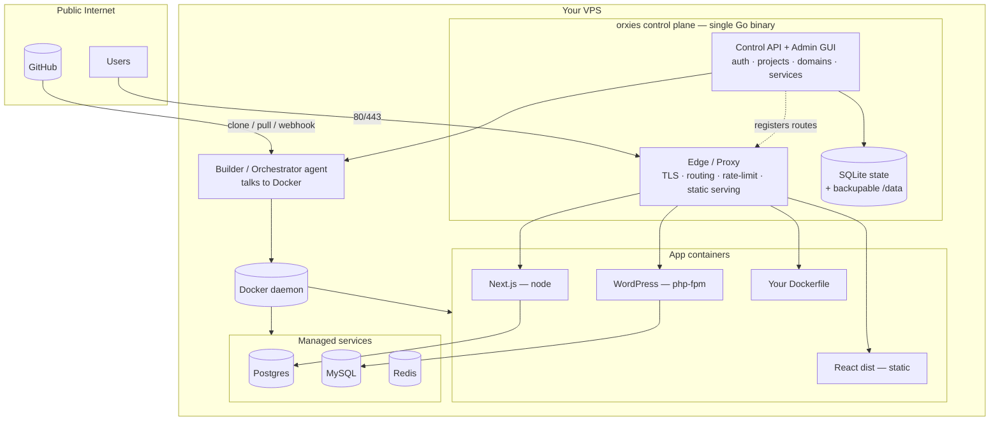
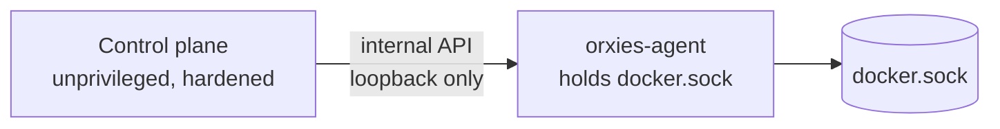
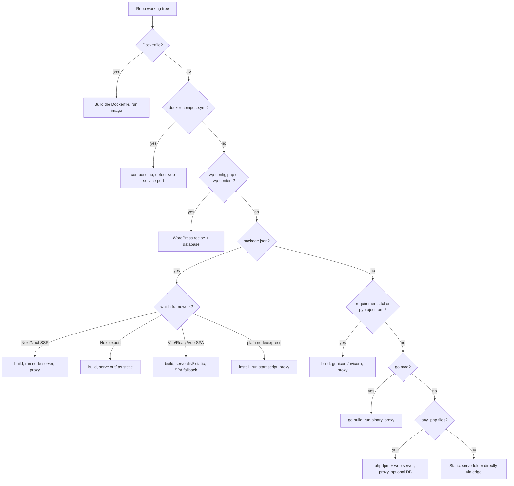
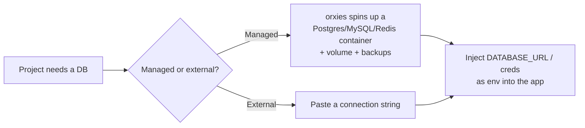
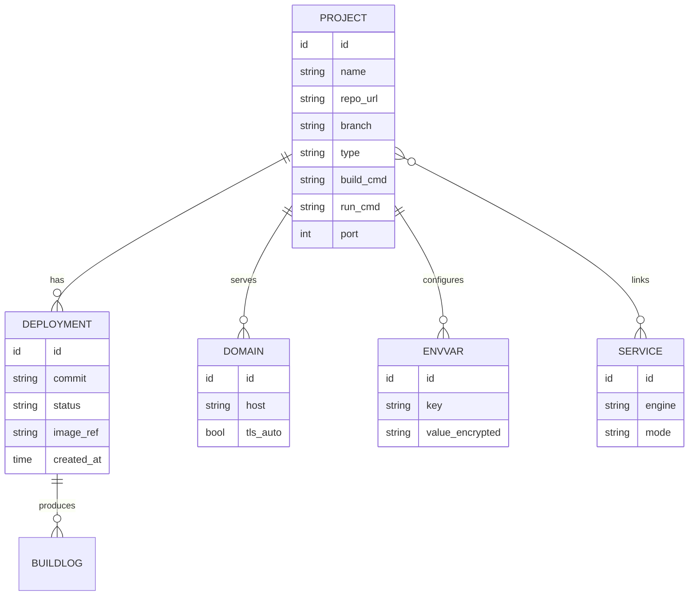
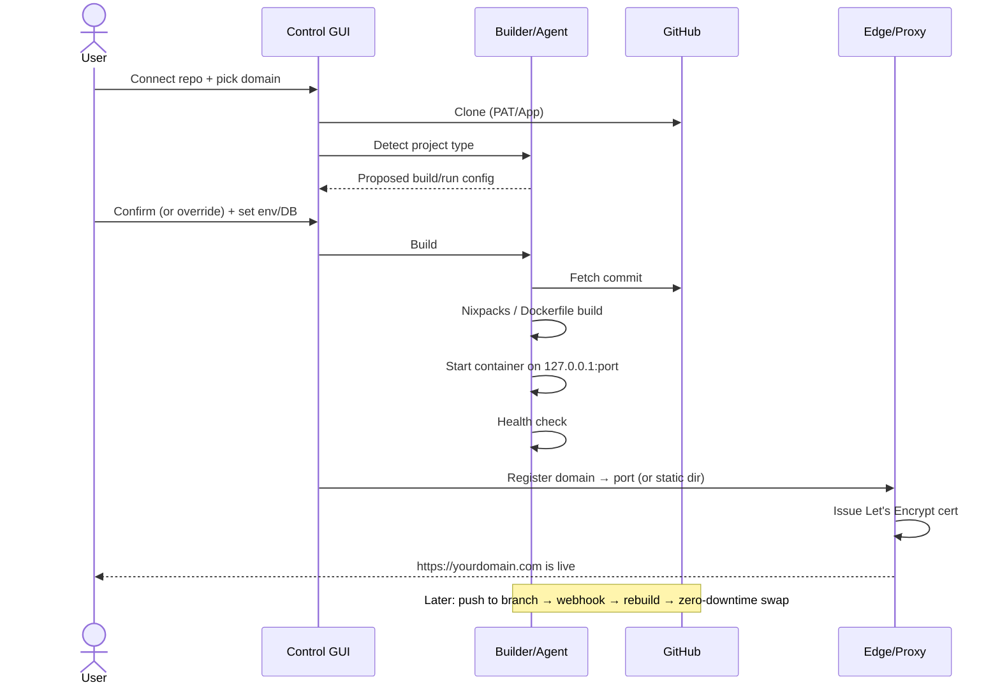

# orxies — Architecture & Roadmap

> The plan for turning orxies from a reverse-proxy + admin UI into a **self-hosted deployment platform**: connect a Git repo, orxies detects the project type, builds it, runs it, wires a domain + TLS, and keeps it live — all from one GUI, no SSH, no manual `git clone`, no per-project YAML.

This document is the north star. It marks clearly what **exists today (✅)** and what is **planned (🚧)** so contributors and users are never misled.

---

## 1. Vision

One open-source binary + GUI that takes any project from *"here's my GitHub repo"* to *"it's live at my domain over HTTPS"* — for **every** common project shape:

| You have… | orxies does… |
|---|---|
| A GitHub repo (any stack) | Connects, clones, and redeploys on every push |
| A React/Vue/Vite app | Detects it, runs the build, serves the `dist/` over TLS |
| A Next.js/Nuxt app | Builds and runs the SSR server (or serves the static export) |
| A raw HTML / static site | Serves the folder directly — no server needed |
| A raw PHP site | Runs PHP-FPM + web server, optionally with a database |
| A WordPress site | Runs WordPress + a managed or external database, persistent uploads |
| A Dockerfile / compose project | Builds and runs it as-is |
| A Python/Go/Node API | Builds, runs it on a port, routes the domain to it |

Positioning: the **security-first, single-core-binary** entry in the self-hosted PaaS space (Coolify, CapRover, Dokku, Dokploy). Differentiators: a locked-down Go control plane, a genuinely modern GUI, and a config you can still read and version-control.

---

## 2. Design principles

1. **One control-plane binary.** The Go core stays a single static binary. Heavy lifting (builds, app runtimes, databases) happens in Docker containers it orchestrates — not inside the core.
2. **Security-first.** The admin plane is already hardened (2FA, CSRF, rate-limit, IP allowlist, audit log, strict CSP — see [§10](#10-security-model)). Every new capability inherits those guards.
3. **Zero-config by default, escape hatches everywhere.** Auto-detect and "just deploy," but always allow a `Dockerfile`, a custom build command, or explicit settings to win.
4. **Portable & GitOps-friendly.** State lives in a SQLite file + on-disk config you can back up with `tar` and restore on a new VPS. Site configs remain exportable YAML.
5. **No lock-in to a cloud.** Runs on any VPS with Docker. Your data, your server.

---

## 3. Target architecture

**Component split**

| Component | Role | Status |
|---|---|---|
| **Edge / Proxy** | TLS termination (Let's Encrypt), host-based routing, rate-limit, exploit block, **static file serving** | ✅ built |
| **Control API + GUI** | Admin auth, dashboard, domains, projects, services, settings | ✅ (auth/domains/UI/projects) · 🚧 (services) |
| **State store** | **SQLite** in `data/` (sites still exportable as YAML) | ✅ |
| **Builder** | Clone repo → detect type → produce a runnable artifact (Nixpacks/Dockerfile image or static dir) | ✅ |
| **Orchestrator agent** | Create/start/stop app + (soon) service containers via Docker, publish to loopback ports | ✅ |
| **Managed services** | Postgres/MySQL/Redis containers on a shared net, encrypted creds, env injection (backups: Phase 6) | ✅ |
| **Git integration** | Git clone/pull (go-git) + tokens + deploy-on-push webhooks; GitHub App later | ✅ (PAT) |

---

## 4. The privilege model (the key security decision)

To build and run arbitrary projects, **something must control the Docker daemon** — and `docker.sock` is root-equivalent. This directly tensions with the hardened, non-root, cap-dropped control plane we built in Phase 1.

**Recommended design:** a dedicated **`orxies-agent`** container that is the *only* thing mounting `docker.sock`. It exposes a narrow, authenticated internal API (build image X, run container Y on loopback port Z, stream logs, stop/rm). The control plane stays unprivileged and talks to the agent over the loopback/local socket only.

Hardening on top:
- Prefer **rootless Docker** or **Podman** where available to shrink blast radius.
- Agent accepts commands only from the control plane (shared secret / unix socket perms), never from the network.
- Every build/run action is written to the existing **audit log**.
- App containers run with `no-new-privileges`, dropped caps, read-only root FS where possible, per-project resource limits, and isolated networks.

> **Decision to confirm:** accept that the platform (via the agent) requires Docker access. This is unavoidable for any deploy platform (Coolify/CapRover/Dokku all do it); the agent split is how we contain it.

---

## 5. Project auto-detection (the "brain")

When a repo is connected, the builder inspects the working tree and picks a strategy. **Precedence matters** — an explicit `Dockerfile` always wins over guessing.

### Support matrix

| Project type | Detect signal | Build step | How it's served | DB option |
|---|---|---|---|---|
| **Static / raw HTML** ✅ | only `*.html/css/js`, no manifest | none | edge static backend (built in Phase 2a) | — |
| **React / Vue / Vite (SPA)** 🚧 | `package.json` + vite/react/vue, `build` script | `npm ci && npm run build` | edge static serves `dist/` or `build/`, SPA fallback on | optional |
| **Next.js / Nuxt (SSR)** 🚧 | `next`/`nuxt` dep | build | run node server on a port → proxy | optional |
| **Next.js static export** 🚧 | `next` + `output: 'export'` | build | edge static serves `out/` | — |
| **Node / Express API** 🚧 | `package.json` `start`, no build framework | `npm ci` | run on a port → proxy | optional |
| **Raw PHP** 🚧 | `*.php`, no composer/wp | — | php-fpm + web server container → proxy | optional |
| **WordPress** 🚧 | `wp-config.php` / `wp-content` | — | WordPress container + persistent volume → proxy | **required** (managed or external) |
| **Python (Django/Flask/FastAPI)** 🚧 | `requirements.txt`/`pyproject.toml` | install | gunicorn/uvicorn on a port → proxy | optional |
| **Go** 🚧 | `go.mod` | `go build` | run binary on a port → proxy | optional |
| **Dockerfile** 🚧 | `Dockerfile` | `docker build` | run image, publish port → proxy | optional |
| **docker-compose** 🚧 | `docker-compose.yml` | `compose build` | `compose up`, route web service → proxy | its own |

Every detection result is a **proposal shown in the GUI** — the user can override the build command, output dir, run command, port, and env before the first deploy.

---

## 6. Build & runtime strategy

**Build** (repo → artifact):
- **Primary: [Nixpacks](https://nixpacks.com).** Auto-detects Node/Python/PHP/Go/etc. and produces an OCI image with zero config — the same engine Railway/Coolify use. Covers the majority of the matrix for free.
- **Escape hatch: `Dockerfile`.** If present (or the user provides one), it wins — full control.
- **Framework recipes** for the cases worth special-casing (WordPress image + volume, static SPA output-dir detection, PHP-FPM base).
- **Static shortcut:** SPA/HTML/Next-export don't need a runtime container — orxies builds, then hands the output folder to the **edge static backend** already shipped in Phase 2a.

**Run** (artifact → live):
- Non-static apps run as Docker containers published to a unique `127.0.0.1:<port>`, then registered as a normal **proxy site** (reusing today's router).
- Static outputs register as a **static site** (reusing today's `root` backend).
- **Zero-downtime deploys:** build the new version, health-check it on a new port, flip the route, drain the old container, then remove it.
- **Rollback:** keep the last N images; "rollback" re-points the route to a previous one.

---

## 7. Managed services (databases & add-ons)

Projects that need a datastore get a choice at deploy time:

- **Engines:** Postgres, MySQL/MariaDB, Redis first; Mongo later.
- **Managed:** container + named volume + auto-generated credentials, stored encrypted, injected as `DATABASE_URL` (and engine-specific vars) into linked projects.
- **External:** user pastes their own connection string; orxies just injects it.
- **Backups:** scheduled `pg_dump`/`mysqldump` to `/data/backups`, with restore from the GUI.
- WordPress and other DB-required types wire this automatically.

---

## 8. Data model

Moves from "one YAML per site" to a small **SQLite** schema (with YAML/JSON export for portability & GitOps).

Domains and static/proxy routing continue to work exactly as today; `sites/*.yml` remains a supported export/import format so nothing is trapped in the DB.

---

## 9. GUI information architecture

The sections you asked for, each a first-class area of the admin GUI:

| Section | Contents | Status |
|---|---|---|
| **Dashboard** | Fleet overview, live traffic, health | ✅ (extend) |
| **Projects** | Connect repo → detect → configure → deploy → logs → rollback → link domain → attach services | 🚧 |
| **Domains** | Add domain, point, port, SSL/TLS auto-issue | ✅ |
| **Services** | Managed DBs/caches, credentials, backups | 🚧 |
| **Security** | Admins, 2FA, IP allowlist, audit log, CSP | ✅ (extend per-project) |
| **Scaling / LB** | Replicas, round-robin upstreams, health checks | ✅ (pool) · 🚧 (replicas) |
| **DevOps / Settings** | Build settings, webhooks, backups, system, updates | 🚧 |

---

## 10. Security model

Inherits everything from Phase 1 (all ✅):

- Hardened admin plane: bcrypt + **TOTP 2FA**, **CSRF** on every mutation, **login rate-limit/lockout**, **IP allowlist**, strict **CSP** + security headers, **audit log**, hostname validation, loopback-by-default (reach via SSH/VPN).

Adds (🚧) for the platform:

- **Agent isolation** for Docker access ([§4](#4-the-privilege-model-the-key-security-decision)).
- **Secrets encryption at rest** for env vars + DB credentials (age/NaCl, key in `/data`).
- **Per-project container isolation** — dropped caps, `no-new-privileges`, read-only FS where possible, resource limits, isolated networks, no host mounts by default.
- **Build sandboxing** — builds run in throwaway containers, never on the host.
- **RBAC / multi-user / teams** — later, for shared instances.
- **Supply-chain hygiene** — pin base images, scan built images (Trivy) as an optional gate.

---

## 11. Deploy lifecycle (end to end)

---

## 12. Roadmap (phased delivery)

Each phase is independently shippable and leaves the tool fully working.

| Phase | Theme | Key deliverables | Status |
|---|---|---|---|
| **1** | Security hardening | 2FA, CSRF, rate-limit, IP allowlist, audit, CSP | ✅ done |
| **2a** | Static backend | Serve a folder directly, SPA fallback | ✅ done |
| **2b** | UI overhaul | Lucide icons, sparklines, per-site stats, toasts | ✅ done |
| **3** | Runtime foundation | SQLite store · Project model · **orxies-agent** (Docker over a unix socket) · deploy-from-path · Dockerfile builds · zero-downtime redeploy · lifecycle (deploy/stop/remove/logs) · Projects GUI | ✅ done |
| **4** | Git + build | Git repo source (clone/pull via go-git) · encrypted access tokens (private repos) · richer auto-detect · **deploy-on-push webhooks** (HMAC) · Projects GUI git fields | ✅ done¹ |
| **5** | Managed services | Postgres/MySQL/Redis add-ons on a shared network · encrypted creds · **env injection** (`DATABASE_URL` + custom vars) · external-DB option · Services GUI | ✅ done² |
| **6** | Framework polish | **rollback history ✅** · **bento UI revamp ✅** (expandable site rows, loading/progress states, responsive) · WordPress recipe · static-export detection · service backups · preview envs | 🚧 in progress |
| **7** | Scale & DevOps | Replicas/load-balancing · alerts · multi-node · RBAC/teams · image scanning | 🚧 |

**Phase 3 is the pivot** — once the agent can build-and-run one project from a local path and orxies routes to it, everything after is additive.

² Phase 5 note: Managed Postgres/MySQL/Redis, encrypted credentials, a shared `orxies-net` (apps reach DBs by container name), env injection (`DATABASE_URL`/`PG*`/etc. + custom vars), and external services are done and verified live (provisioned Postgres → linked app connected to it). Scheduled **backups** move to Phase 6.

¹ Phase 4 note: Git-source + tokens + auto-detect + webhooks + **Nixpacks** are done and verified. The agent image ships a pinned, static musl `nixpacks` binary + `buildx`; a real no-Dockerfile Node build was verified end to end (build → run → serve on `$PORT`). Both build paths — `Dockerfile` and Nixpacks — are live.

---

## 13. Decisions

**Locked (2026-07-26):**

1. ✅ **Docker access via a dedicated `orxies-agent`** ([§4](#4-the-privilege-model-the-key-security-decision)) — control plane stays unprivileged; the agent is the only thing holding `docker.sock`.
2. ✅ **Nixpacks as the primary build engine** ([§6](#6-build--runtime-strategy)), with a repo `Dockerfile` as the always-wins escape hatch.
3. ✅ **SQLite for platform state** ([§8](#8-data-model)) — single embedded file in `/data`, backup-with-`tar`; YAML export kept for domains/portability.

**Still open:**

4. **Name / positioning** — keep `orxies`, or rebrand for the wider "deployment platform" scope before going public. (Leaning: keep `orxies`.)

**Next build:** Phase 3 (runtime foundation) — detailed, buildable spec in **[docs/PHASE-3.md](PHASE-3.md)**.

---

*Contributions welcome. This document evolves with the project — update the ✅/🚧 markers as phases land.*
