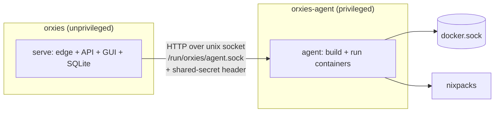

# Phase 3 — Runtime foundation (buildable spec)

> Goal: prove the deploy engine end to end. After Phase 3, orxies can take a **project from a local path**, build it (Nixpacks or its Dockerfile), run it as a container on a loopback port, route a domain to it, and let you **start / stop / restart / view logs** from the GUI. Git, webhooks, managed databases, and framework recipes come in later phases — this phase builds the machine they all ride on.

Locked decisions from [ARCHITECTURE §13](ARCHITECTURE.md#13-decisions): dedicated **agent** for Docker, **Nixpacks + Dockerfile** builds, **SQLite** state.

---

## 1. Scope

**In scope**
- `orxies-agent` role (Docker orchestration behind a loopback-only API).
- SQLite state store (`projects`, `deployments`, `port allocations`; domains stay as today + a link).
- Deploy a project **from a local path** (git comes in Phase 4).
- Build via **Nixpacks**, or the repo's **Dockerfile** if present.
- Run the built image as a container on `127.0.0.1:<allocated-port>`, register it as a normal proxy site.
- Lifecycle: **start / stop / restart / remove / logs / status** from the GUI.
- Zero-downtime **redeploy** (build new → health-check → flip route → drain old).

**Out of scope (later phases)**
- GitHub connect / clone / webhooks (Phase 4).
- Managed databases + env injection (Phase 5).
- WordPress/PHP/Python recipes, rollback history UI, preview envs (Phase 6).
- Multi-node, replicas, RBAC (Phase 7).

---

## 2. Component layout — one binary, two roles

Keep the single-binary philosophy. The same binary runs in two modes:

| Role | Command | Container | Privilege |
|---|---|---|---|
| Control plane + edge + GUI | `orxies serve` | `orxies` (today) | unprivileged, cap-drop (unchanged) |
| Orchestration agent | `orxies agent` | `orxies-agent` (new) | holds `docker.sock`, has `nixpacks` + `docker` CLI |



**Transport:** HTTP over a **unix domain socket** shared via a volume (`/run/orxies/agent.sock`). Go serves it with `net.Listen("unix", …)` + `http.Serve`; the control plane dials it with an `http.Client` whose `DialContext` targets the socket.

**Auth:** a 32-byte secret generated to `/data/agent.key` (mode 0600), mounted read-only into both containers. Every agent request carries it in an `Authorization` header, compared with `hmac.Equal`. The socket never touches the network. Agent refuses to start if the key is missing.

---

## 3. Agent API (loopback only, JSON)

| Method / path | Body | Returns |
|---|---|---|
| `POST /v1/build` | `{project_id, source_path, strategy, dockerfile?, build_cmd?}` | streams build log; final `{image_ref}` |
| `POST /v1/run` | `{project_id, image_ref, port, env{}, limits{}}` | `{container_id}` |
| `POST /v1/stop` | `{container_id}` | `{ok}` |
| `POST /v1/remove` | `{container_id}` | `{ok}` |
| `GET  /v1/logs?container_id=&follow=` | — | streamed log lines |
| `GET  /v1/status?container_id=` | — | `{state, health, started_at}` |
| `GET  /v1/health` | — | `{ok, docker_ok, nixpacks_ok}` |

- **Build** shells out to `nixpacks build <path> --name ` (Nixpacks drives Docker), or `docker build` when a `Dockerfile` is present / strategy is `dockerfile`.
- **Run** does `docker run -d --restart unless-stopped -p 127.0.0.1:<port>:<app-port> --memory <limit> --security-opt no-new-privileges --cap-drop ALL <env…> `. App port is detected from the image (`EXPOSE`) or defaulted per strategy.
- Every action is written to the existing **audit log** with the acting admin (passed through from the control plane).

---

## 4. Data model (SQLite)

Pure-Go driver **`modernc.org/sqlite`** so the static `CGO_ENABLED=0` build is preserved (no cgo). DB file at `/data/orxies.db`; schema migrations embedded and applied on boot.

```sql
CREATE TABLE projects (
  id            INTEGER PRIMARY KEY,
  name          TEXT NOT NULL UNIQUE,
  source_path   TEXT NOT NULL,              -- local path in Phase 3
  strategy      TEXT NOT NULL,              -- 'nixpacks' | 'dockerfile' | 'static'
  build_cmd     TEXT,                        -- override, nullable
  run_cmd       TEXT,                        -- override, nullable
  app_port      INTEGER,                     -- port inside the container
  domain        TEXT,                        -- linked domain (FK to a site)
  created_at    TEXT NOT NULL
);

CREATE TABLE deployments (
  id            INTEGER PRIMARY KEY,
  project_id    INTEGER NOT NULL REFERENCES projects(id) ON DELETE CASCADE,
  status        TEXT NOT NULL,               -- queued|building|running|failed|stopped
  image_ref     TEXT,
  container_id  TEXT,
  host_port     INTEGER,                     -- allocated 127.0.0.1:<host_port>
  commit_sha    TEXT,                        -- unused in P3, ready for P4
  created_at    TEXT NOT NULL,
  finished_at   TEXT
);

CREATE TABLE port_allocations (
  host_port     INTEGER PRIMARY KEY,         -- range 8300-8999 for app containers
  deployment_id INTEGER REFERENCES deployments(id) ON DELETE SET NULL
);
```

Domains/routing keep working exactly as today; a deployed project simply creates/updates a **proxy site** pointing at its `127.0.0.1:<host_port>`. `sites/*.yml` remains a supported export.

---

## 5. Deploy-from-path flow

```mermaid
sequenceDiagram
    actor Admin
    participant GUI as Control plane
    participant Agent
    participant Edge
    Admin->>GUI: New project (name, path, domain)
    GUI->>GUI: Detect strategy (Dockerfile? else Nixpacks; only-HTML? static)
    GUI->>GUI: Allocate free host port (8300-8999)
    GUI->>Agent: POST /v1/build (streams log to GUI)
    Agent-->>GUI: image_ref
    GUI->>Agent: POST /v1/run (image, port, env)
    Agent-->>GUI: container_id
    GUI->>Agent: GET /v1/status (health)
    GUI->>Edge: register proxy site domain → 127.0.0.1:port
    Edge->>Edge: issue TLS
    GUI-->>Admin: live + streaming logs
```

**Redeploy** (same flow) is zero-downtime: build the new image, run it on a **new** port, health-check, flip the site's upstream to the new port, then stop/remove the old container and free its port.

---

## 6. Port allocation

- Reserve **8300–8999** for app containers (documented; proxied projects, not user-facing).
- Allocate the lowest free port not in `port_allocations` and not currently `LISTEN` on the host; persist the assignment against the deployment; release on stop/remove.

---

## 7. GUI additions (minimal for Phase 3)

New **Projects** section:
- **List** — name, type badge, status (running/stopped/failed), domain, quick start/stop.
- **New project** — name, local path, domain (dropdown of existing domains or add-new), detected strategy shown with override fields (build cmd / run cmd / app port).
- **Detail** — status, deploy button, **live build + runtime logs** (reuse the existing poll mechanism or add SSE), start/stop/restart/remove.

Reuse existing components (cards, badges, sparklines, toasts, Lucide icons). All new mutations get **CSRF + audit** like everything else.

---

## 8. Compose / packaging changes

```yaml
services:
  orxies:            # unchanged, unprivileged
    # …existing…
    volumes:
      - ./data:/etc/orxies/data
      - agentsock:/run/orxies        # shared socket
      - ./data/agent.key:/etc/orxies/data/agent.key:ro
  orxies-agent:      # new, privileged
    image: orxies:${ORXIES_VERSION:-dev}
    command: ["agent", "--socket", "/run/orxies/agent.sock"]
    restart: always
    volumes:
      - /var/run/docker.sock:/var/run/docker.sock
      - agentsock:/run/orxies
      - ./data/agent.key:/etc/orxies/data/agent.key:ro
volumes:
  agentsock:
```

The agent image adds the `nixpacks` binary + `docker` CLI (multi-stage; the `serve` image stays lean). Document the privilege tradeoff prominently in the README security section.

---

## 9. Security notes (Phase 3)

- Agent API is **unix-socket + shared-secret only** — never bound to a TCP port.
- App containers: `--cap-drop ALL`, `--security-opt no-new-privileges`, memory/CPU limits, no host bind-mounts by default, isolated network.
- Builds run in throwaway containers (Nixpacks/Docker), never on the host.
- Every build/run/stop/remove is **audit-logged** with the acting admin.
- The docker-socket privilege is isolated to the agent; the internet-facing edge + GUI stay unprivileged.

---

## 10. Definition of done

- [x] `orxies agent` serves the API over a unix socket with shared-secret auth; `serve` talks to it.
- [x] SQLite store with migrations; `projects` + `deployments` + `port_allocations`.
- [x] Create a project from a local path → **Dockerfile** build → running container on an allocated loopback port. *(Nixpacks build path implemented; hardening its presence in the agent image is Phase 4.)*
- [x] Domain routes to it (reusing today's proxy; TLS via the existing ACME path).
- [x] Deploy / stop / remove / logs from the GUI (restart = redeploy).
- [x] Zero-downtime redeploy (new port → health → flip → drain old) — unit-tested.
- [x] `go build` / `go vet` / `go test` green; store/agent/deploy/ui unit-tested; a **live end-to-end deploy** (build image → run container → route `demo.test` through the edge → teardown) verified against real Docker.
- [x] README + this spec updated (✅/🚧 markers moved).

---

## 11. New dependencies

| Dep | Why | Notes |
|---|---|---|
| `modernc.org/sqlite` | State store | **Pure Go** — keeps `CGO_ENABLED=0` static build |
| `nixpacks` (binary, in agent image) | Build engine | Not a Go dep; installed in the `orxies-agent` image |
| Docker Engine API (via `docker` CLI or `github.com/docker/docker/client`) | Container lifecycle | Prefer the official client; agent-only |

This is the first time orxies gains real dependencies beyond the proxy core — all confined to the agent + the state layer, both introduced deliberately here.
